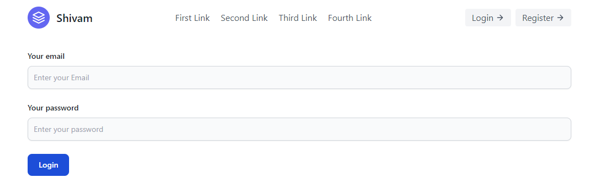
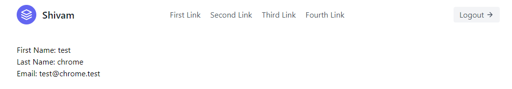

## MERN Authentication system Basic

This is a basic mern authentication system which has 4 routes

1. Login
1. Register
1. Logout
1. Dashboard

- The dashboard is only accesible if the user is logged in otherwise the user is redirected to login page.

- Once user registers/logs in the token is saved in the local storage which is sent into headers with every request and the backend checks for it and if valid the user is allowed to view the dashboard page.

- If the token is invalid/expired user is not allowed to view the dashboard page.

- After log in if the user tries to visit the login page again they are redirected back to the dashboard

### Steps to run the app locally

1. Clone the repository `git clone https://github.com/shivamvijaywargi/mern-auth.git`
1. `cd client` and run `yarn`
1. `cd server` and run `yarn`
1. In the server folder add your environment variables in .env file (For reference check .env.example)
1. To start the backend run `yarn dev` from server folder and to start the frontend run `yarn dev` from the client folder.

### Screnshots

### Note: This is not a perfect auth app there might be many bad practices and many performance issues. This is just a dummy project I have built to test my knowledge.
